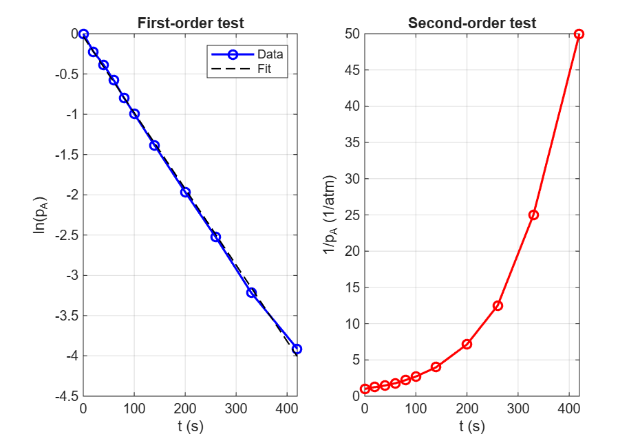

# Kinetic Analysis and Mixed Flow Reactor Sizing (MATLAB)

## Objective
Determine the reaction order and rate constant from batch reactor data, then use it to size a mixed flow reactor for a target conversion.

## Data
Batch reactor data (partial pressure of A vs time, 100°C) for the gas-phase decomposition 2A → R + S, from a Chemical Kinetics and Reaction Engineering course problem set.

## Method
1. Tested the reaction order by plotting ln(p_A) vs t (first-order test) and 1/p_A vs t (second-order test).
2. Fitted a straight line to the first-order plot to find the rate constant k.
3. Sized a mixed flow reactor for 95% conversion of a 100 mol/hr feed (20% inerts, 1 atm, 100°C) using the fitted k.

## Results
- Reaction order: first order (ln p_A vs t gave the straight line)
- Rate constant: k = 0.0095 /s (0.5675 /min) at 100°C
- Feed concentration of A: C_A0 = 0.0261 mol/L
- Mixed flow reactor volume for 95% conversion: 2136.86 L (about 2.1 m^3)

## Plot

## How to Run
Open `kinetics_fit.m` in MATLAB and click Run.

## Author
Roshni
